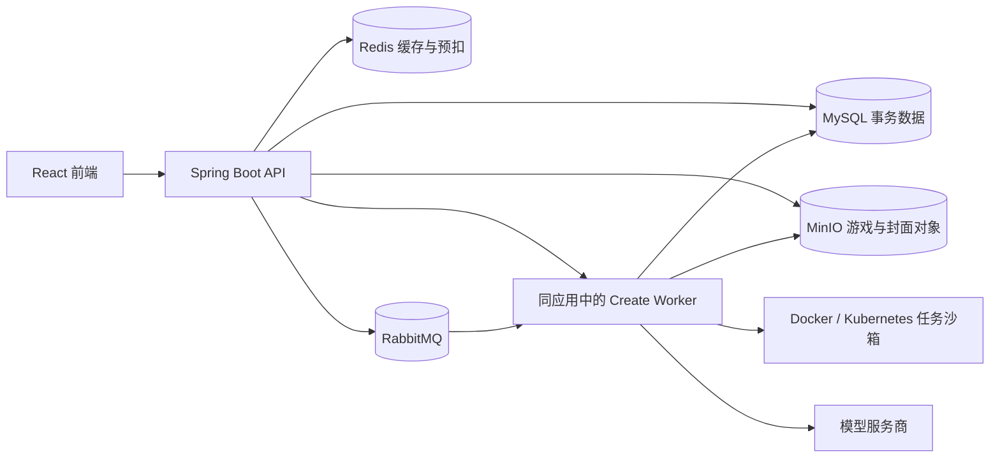

# 整体架构

## 运行形态

GameWeare 是前后端分离的模块化单体。[React 应用](../apps/web/src/App.tsx) 通过 HTTP 调用 [Spring Boot 应用](../apps/api-java/src/main/java/com/gameweare/api/GameWeareApplication.java)；同一个 Java 部署同时承载 API、Outbox 投递和创建任务 Worker。AgentScope、旧版模型调用与封面阶段由任务创建时固定的 `engine` 选择。旧 Python 后端只在 `archive/python-api` 中留作行为对照。

## 模块与数据归属

| 模块 | 主要代码 | 保存什么 / 谁是事实来源 |
| --- | --- | --- |
| 认证与账号 | [`auth`](../apps/api-java/src/main/java/com/gameweare/api/auth) | MySQL 用户和会话摘要；Redis 做限流、会话缓存与撤销标记 |
| 游戏目录与社区 | [`catalog`](../apps/api-java/src/main/java/com/gameweare/api/catalog) | MySQL 游戏、点赞、关注；Redis 缓存详情、热榜和集合投影 |
| 创作与发布 | [`create`](../apps/api-java/src/main/java/com/gameweare/api/create) | MySQL 项目、任务、版本、步骤、用量与 Outbox；MinIO 保存 HTML、封面 |
| 游玩 | [`play`](../apps/api-java/src/main/java/com/gameweare/api/play) | MySQL 游玩事件和去重计数；Redis HLL 是近似 UV 展示 |
| 上传 | [`storage`](../apps/api-java/src/main/java/com/gameweare/api/storage) | MySQL 资产归属；MinIO 保存文件字节 |
| 签到与生成券 | [`voucher`](../apps/api-java/src/main/java/com/gameweare/api/voucher) | MySQL 发券、库存、核销与签到事实；Redis Lua/Stream 是秒杀预扣通道 |
| 管理与个人中心 | [`maintenance`](../apps/api-java/src/main/java/com/gameweare/api/maintenance)、[`profile`](../apps/api-java/src/main/java/com/gameweare/api/profile) | 按角色或本人身份查询业务记录 |

数据库结构从 [Flyway V1–V12](../apps/api-java/src/main/resources/db/migration) 演进。MinIO 是对象存储，不替代 MySQL 的事务表。缓存、排行、Bitmap 和 HLL 都不决定授权、发券或计费结果。

## 三条主链路

1. **创作**：`POST /create/jobs` 在一个 MySQL 事务中创建项目/任务、必要时占用券，并写 Outbox。投递器确认 RabbitMQ 收到消息；Worker 用租约认领任务，调用模型，校验 HTML，先保存 MinIO 对象，再写版本和任务终态。发布是独立操作，优化时先生成草稿版本，发布后才切换公开版本。
2. **试玩**：前端读取 `/play/{slug}/manifest`，再把 `/play/{slug}/document` 装入 `sandbox="allow-scripts"` iframe。后端仅向已发布的公开游戏返回 HTML，并附带 CSP；游玩事件写 MySQL，热榜和近似 UV 可随后更新。
3. **生成券秒杀**：Redis Lua 原子预扣库存并把预留写入 Stream；RabbitMQ 转发后，MySQL 事务条件扣库存、检查同场唯一并发券。页面先显示预留中，只有 MySQL 提交后才显示券到账；失败预留由重试/对账补偿。

## 部署与边界

- [开发 Compose](../docker-compose.yml) 启动前后端和四个依赖服务；[双实例覆盖配置](../docker-compose.multi-instance.yml) 用于并发验收；[生产配置](../docker-compose.prod.yml) 要求显式密钥。
- [CI](../.github/workflows/ci.yml) 构建 Java 与前端，并运行隔离环境的冒烟、双实例和秒杀验证。CI 通过不等于真实模型、Google OAuth、Kubernetes 或持续压测通过。
- 生成的 HTML 是不可信内容：语法与资源规则由后端校验，浏览器再用 sandbox iframe 和 CSP 限制执行；这些检查不能证明玩法质量或完全排除恶意内容。
- 真实 Kubernetes 沙箱和硬网络出口限制仍需在目标集群验收。现有本机 Docker 沙箱只覆盖本地开发路径。
