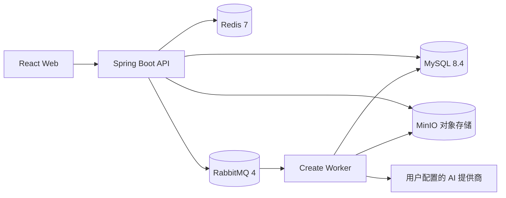
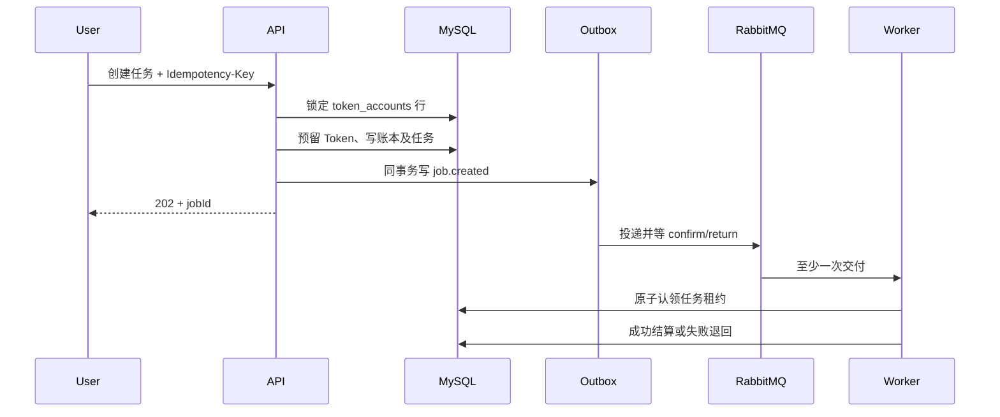

# Java 后端架构与一致性设计

## 服务边界

`apps/api-java` 为单体应用，按业务模块划分，而非提前拆成多个服务。MySQL 保存可事务化的业务事实，MinIO 保存大对象；Redis 是缓存和限流，RabbitMQ 是任务传输。Java 代码从 `archive/python-api` 迁移，两个同名 GitHub 项目不混用。

## 登录与会话

- 注册密码由 BCrypt 哈希，登录后生成 256 位随机 Bearer Token；MySQL 仅保存其 SHA-256 摘要。
- Redis Lua 脚本原子计数同一邮箱的一分钟登录尝试，超过阈值返回 429。
- MySQL 会话记录是有效性来源，Redis 缓存已验证的用户资料最多 60 秒，且不超过数据库会话到期时间。
- 退出先写 Redis 撤销标记、删除缓存，再撤销 MySQL 会话；各实例共享撤销标记。
- 业务请求由 `AuthFilter` 注入身份，个人数据查询还需按 `user_id` 检查所属关系。维护接口要求 `admin` 或 `maintainer` 角色。

## Token 计费与任务一致性

- 账户余额与预留额在 MySQL 单一事务中更新，`SELECT ... FOR UPDATE` 串行化同账户扣费；账本按 `job_id + entry_type` 唯一约束去重。
- 客户端重试可带 `X-Idempotency-Key`。同用户同键只创建一个任务；相同键对应不同请求返回冲突。
- 任务与 Outbox 同事务写入，避免“扣费成功但任务消息丢失”。Publisher 等待 RabbitMQ 确认并检测不可路由退回，再标记已发送；超时或失败重试。
- Worker 用条件更新认领、续约和重试；过期任务最多尝试三次。执行失败退回预留 Token。结算使用 AI 服务返回的实际 Token 用量，缺失或不一致时不扣费。
- 同一项目只允许一个进行中的生成任务；生成新版本时锁定游戏行分配版本号，防止并行写版本冲突。

此设计针对至少一次消息投递，不能假定 RabbitMQ “恰好一次”。MinIO 上传发生在数据库最终提交之前，提交失败可能留下孤立对象，需要维护清理流程；余额账本仍由 MySQL 事务保证。

## 安全边界

游戏 HTML 从 MinIO 经后端返回，并在浏览器 `sandbox allow-scripts` 的 iframe 内执行；CSP 禁止外联脚本和网络请求。用户配置的 AI 密钥用 AES-GCM 加密存储，应用密钥取自 `AI_CONFIG_SECRET`。AI 地址要求 HTTPS，禁止重定向并拒绝解析到常见内网/本机 IP。DNS 解析检查到实际连接之间仍可能发生 DNS rebinding；公开部署时需补充网络出口限制或域名白名单。

当前注册提供演示 Token，适合本地作品展示。若接入真实资金，应增加邮箱验证、反滥用和财务对账，并将演示赠额关闭。

## 已执行验证

- Maven 单元测试通过；Vite 构建通过。
- Docker Compose 中 MySQL、Redis、RabbitMQ、MinIO、Java API、Web 均已启动，API 健康检查正常。
- 手工 HTTP 验证注册、会话、退出、列表、个人页、维护权限、任务幂等。
- 12 个并发任务中 6 个预留成功、6 个余额不足被拒绝；无效 AI 密钥使 6 个任务失败并全部退款，账户余额恢复、预留归零。
- 端到端自动化验证（`scripts/e2e-verify.ps1`，配合 `docker compose --profile test up` + `LLM_ALLOW_PRIVATE_ENDPOINTS=true` 与 mock-llm 服务）20 项校验全部通过：chat 模式创建（含幂等重放）→ 生成 → 发布 → 目录 → manifest/沙箱 CSP → 试玩计数；plan 模式预览 → 批准 → 续生成；decentralized 模式三候选 → 选择 → 确认 → 终生成；MySQL 账本一致（1 GRANT、3 RESERVE、3 SETTLE、reserved=0）。生产环境默认拒绝私网 LLM 端点，该开关仅供本地测试栈使用。
