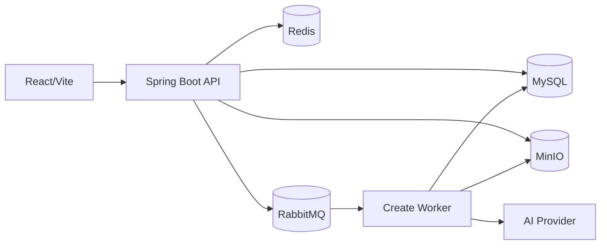

# GameWeare 系统设计（当前 Java 实现）

> 本文描述当前 `apps/api-java`。原 FastAPI/PostgreSQL 方案已归档到 `archive/python-api`，不再是运行架构。更详细的一致性说明见 [Java 后端架构](java-backend-architecture.md)，建设状态见 [计划](../.plan/task.md)。

## 运行结构

后端是模块化单体。`auth` 管登录会话，`billing` 管 Token 账本，`catalog/play/storage` 管游戏及对象，`create` 管 AI 生成，`profile/maintenance` 管用户与运营视图。MySQL 通过 Flyway V1–V4 演进；MinIO 只存游戏 HTML、封面和上传文件。

## 主要链路

1. 注册或登录取得 Bearer Token。MySQL 保存 Token 哈希；Redis 缓存短期会话，并记录限流与退出撤销状态。
2. 创建游戏时，MySQL 事务同时写入任务和 Outbox 事件。Outbox Publisher 将事件发送给 RabbitMQ，Worker 用租约认领。
3. Worker 调用用户配置的 Responses API，记录返回的真实 Token 使用量，把生成文件写入 MinIO，再以数据库事务创建游戏版本。新任务的额度由模型服务商 API 判断，不检查本地虚拟余额；旧任务的预留账本仍可退款。
4. `plan` 与 `decentralized` 模式先保存预览，等待用户批准/选择后再继续；`react` 当前是“生成规划 + 生成游戏”的两次模型调用。归档 Python 中的完整 ReAct 工具循环尚未对齐。
5. 发布后，目录从 MySQL 读取，游玩页通过后端从 MinIO 读取 HTML，在 sandbox iframe 中运行。

## 运行与验证

使用根目录 `docker compose up -d --build` 启动；端口与本地命令见 [README](../README.md)。`scripts/e2e-verify.ps1` 搭配 `--profile test` 的 Mock LLM 验证 chat、plan、decentralized、发布、游玩与账本。真实 Google OAuth 和 AI 服务还需各自的凭证与外部联调。
